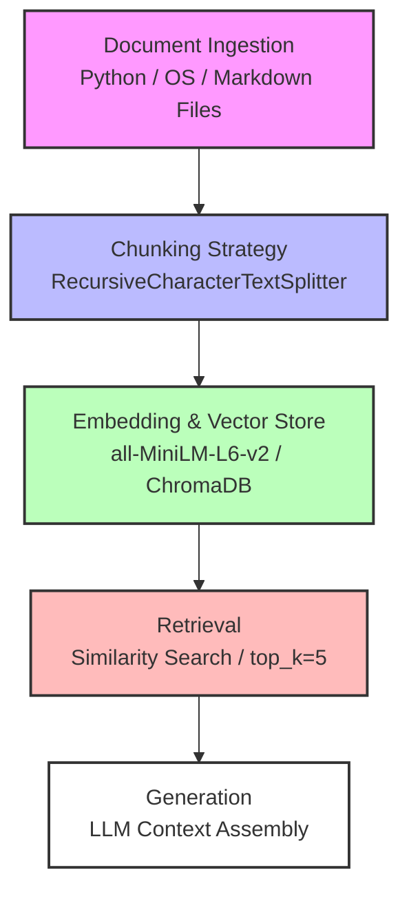

# Project 1 Planning: The Unofficial Guide

> Write this document before you write any pipeline code.
> Your spec and architecture diagram are what you'll use to direct AI tools (Claude, Copilot, etc.) to generate your implementation — the more specific they are, the more useful the generated code will be.
> Update the Retrieval Approach and Chunking Strategy sections if you change your approach during implementation.
> Update this file before starting any stretch features.

---

## Domain

The diverse culinary landscape of San Mateo, CA, focusing specifically on independent neighborhood staples, cultural regional fusion hubs, and local dining logistics (such as wait-time dynamics, off-hours dining, and hidden item availability).

This knowledge is valuable yet difficult to aggregate through official channels. Standard platforms like Yelp or Google Maps heavily prioritize sponsored listings, hide nuanced community consensus behind unhelpful aggregate star ratings, and fail to capture conversational, hyper-local operational realities — such as knowing exactly what time a local bakery sells out of sourdough or identifying which back-alley food stands are cash-only, takeout-exclusive gems.

---

## Documents

| # | Source | Description | URL or location |
|---|--------|-------------|-----------------|
| 1 | Reddit r/SanMateo — Best Non-Chain Restaurant Dinners | Uncovering independent gems: Italian gnocchi, taco trucks, hidden food hall sushi | https://www.reddit.com/r/SanMateo/comments/1kusnwt/best_non_chain_restaurant_in_san_mateo_i_wanna/ |
| 2 | Reddit r/SanMateo — Ultimate Restaurant Recommendation Megathread | Community consensus on cross-genre staples like Daeho Kalbijjim and Backhaus bakery | https://www.reddit.com/r/SanMateo/comments/1ad3cl9/best_restaurants/ |
| 3 | Reddit r/SanMateo — Favorite Neighborhood Spots (Any Cuisine) | Comfort food defaults, daily coffee mainstays, noodle spots like Kaizen and Cobani | https://www.reddit.com/r/SanMateo/comments/1lyrvba/favorite_neighborhood_spots_any_cuisine/ |
| 4 | San Mateo Daily Journal — Local Food & Lifestyle Features | Editorial coverage of legacy businesses, downtown boba landscape, food recovery programs | https://www.smdailyjournal.com/lifestyle/food/ |
| 5 | San Mateo Daily Journal — Interactive Food Story Map | Geographic data linking editorial features to family-owned establishments | https://sm-dj.com/foodmap/ |
| 6 | The MICHELIN Guide — San Mateo Dining Selections | Expert-vetted picks, Bib Gourmand values (e.g., Pausa), and formal inspectoral notes | https://guide.michelin.com/us/en/california/san-mateo/restaurants |
| 7 | Yelp — Top-Rated Late Night Eats in San Mateo | Structural gaps in dining after 10 PM: ramen, izakayas, fast-casual | https://www.yelp.com/search?find_desc=Late+Night+Food&find_loc=San+Mateo%2C+CA (`docs/yelp_late_night.md`) |
| 8 | HappyCow — Vegan and Vegetarian San Mateo | Plant-based menus, dedicated vegan options, cross-contamination notes | https://www.happycow.net/north_america/usa/california/san_mateo/ (`docs/happycow_vegetarian.md`) |
| 9 | Sweet Maple San Mateo — Brunch Operations & Menu | Weekend breakfast logistics, wait-time management, regional fusion (Millionaire's Bacon) | https://www.sweetmaplesf.com/ |
| 10 | Suruki Market & Takahashi Market — Prepared Foods/Deli Guides | Bento schedules, market onigiri, and fresh Friday malasadas at local legacy markets | https://www.yelp.com/search?find_desc=Japanese+Grocery&find_loc=San+Mateo%2C+CA (`docs/japanese_hawaiian_markets.md`) |

---

## Chunking Strategy

**Chunk size:** 500 characters

**Overlap:** 100 characters

**Reasoning:**

Our corpus is a hybrid of highly fragmented conversational prose (Reddit) and dense structured paragraphs (journalism, Michelin). A 500-character chunk (~80–100 words) isolates individual Reddit recommendations cleanly without drowning them in surrounding unrelated text, while still preserving enough sentence structure for the editorial articles.

The 100-character overlap ensures that if a restaurant name appears at the end of one paragraph and its specific dish recommendation follows at the start of the next, both chunks retain the relationship — neither becomes contextually orphaned during retrieval.

**Failure modes avoided:**
- Too small (e.g., 150 chars): *"The kalbijjim at Daeho is amazing but make sure you get cheese on top"* could split the dish name from the topping recommendation, breaking retrieval for a "cheese dishes" query.
- Too large (e.g., 1,500 chars): Distinct reviews for three different restaurants get bundled into one chunk, diluting the embedding vector and muddying retrieval accuracy.

---

## Retrieval Approach

**Embedding model:** `all-MiniLM-L6-v2` via the `sentence-transformers` library — optimal balance between low computational latency and semantic accuracy for short-to-medium text spans.

**Top-k:** 5 chunks per query

**Production tradeoff reflection:**

Semantic search maps text to a multi-dimensional vector space based on conceptual meaning. A query for *"where can I get food after midnight"* recognizes that "midnight" is conceptually adjacent to phrases like *"open late"*, *"2 AM closing"*, and *"night owl"* in the documents — surfacing correct chunks even when the exact keyword never appears.

If deploying at scale with no cost constraints, tradeoffs to weigh:
- **Context length**: shift to `text-embedding-3-large` for massive document blocks
- **Domain fit**: consider models fine-tuned on colloquial/commercial text to better parse slang-heavy or misspelled restaurant reviews
- **Multilingual support**: San Mateo has significant multilingual communities; a multilingual model would improve coverage of non-English source text
- **Latency**: API-hosted models add network overhead vs. locally-run `sentence-transformers`

---

## Evaluation Plan

| # | Question | Expected answer |
|---|----------|-----------------|
| 1 | According to local residents on Reddit, what specific topping should you add to the kalbijjim at Daeho? | Cheese (melted cheese) |
| 2 | Which restaurant in San Mateo is specifically called out in the Michelin Guide as a Bib Gourmand selection? | Pausa |
| 3 | What unique style of bacon is Sweet Maple known for on its weekend fusion brunch menu? | Millionaire's Bacon |
| 4 | What are the specific rules or challenges mentioned by locals for getting fresh malasadas at Takahashi Market? | Only available on Fridays / sell out quickly |
| 5 | What specific item should you order at Suruki Market according to neighborhood guides? | Pre-packaged bento boxes, sushi/sashimi, or market onigiri |

---

## Anticipated Challenges

1. **Noisy text boundaries (Reddit slang/formatting):** Reddit threads contain emojis, markdown quirks, parenthetical tangents, and conversational text. This noise can dilute vector embeddings and cause semantic search to surface irrelevant chunks. *Mitigation:* Implement a light regex pre-cleaning step during document ingestion to strip excessive line breaks and non-standard symbols before chunking.

2. **Context fragmentation across chunk boundaries:** A chunk might say *"The brisket here is incredibly juicy and smoky"* while the restaurant name appeared three sentences prior in the previous chunk. *Mitigation:* Rely on the 100-character overlap to bridge these boundaries, and prompt the LLM to ignore chunks that lack explicit noun references when they cause logical contradictions in the assembled context.

---

## Architecture

---

## AI Tool Plan

**Milestone 3 — Ingestion and chunking (`ingest.py`):**
- *Input to AI:* The Architecture diagram and Chunking Strategy section of this document
- *Expected output:* A Python script using `langchain_text_splitters.RecursiveCharacterTextSplitter` configured for 500/100 chunk/overlap, reading from the local `docs/` directory
- *Verification:* Print chunk count and spot-check 3–5 chunks manually to confirm boundaries don't split restaurant names from their descriptions

**Milestone 4 — Embedding and retrieval (`vector_store.py`):**
- *Input to AI:* The Retrieval Approach section and Python environment dependencies
- *Expected output:* A script that initializes ChromaDB locally, embeds chunks using `all-MiniLM-L6-v2`, and persists the index to disk
- *Verification:* Run each of the 5 evaluation questions as raw queries and confirm top-5 retrieved chunks contain the expected restaurant/detail

**Milestone 5 — Generation and interface (`query_engine.py`):**
- *Input to AI:* The Retrieval Approach section and the 5 Evaluation Plan questions
- *Expected output:* A script that accepts a user string, fetches top-5 chunks from ChromaDB, formats them into a grounded system prompt, and passes them to an LLM for answer generation
- *Verification:* Run all 5 evaluation questions end-to-end and compare outputs against expected answers; flag any partial or inaccurate responses for failure case analysis
